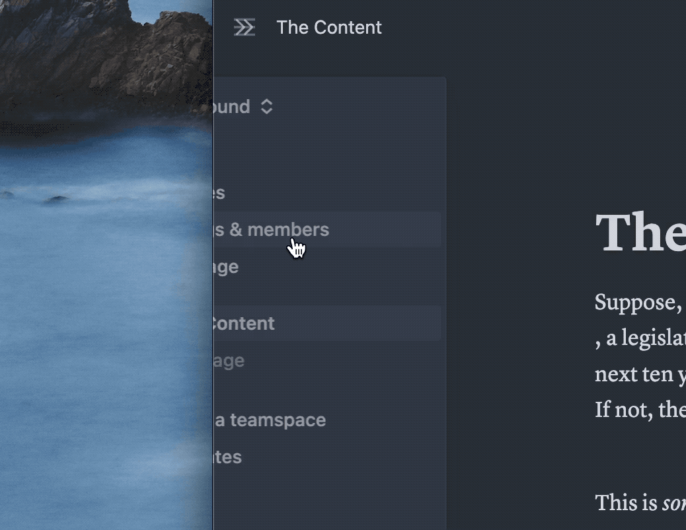

 

<h1 align="center">Notion Sidebar Tamer</h1>

Disable the hover sidebar in Notion.

<a href="https://chrome.google.com/webstore/detail/notion-sidebar-tamer/kkjflddbknmcnjodgeobojmdacilodlb">Chrome Web Store</a>

 

## Introduction

The sidebar in Notion is a great way to navigate between pages, but it can be distracting when you're working between windows. This Chrome extension disables the appearing on hover of the sidebar.

## Installation

Please refer to Chrome's [documentation](https://developer.chrome.com/docs/extensions/mv3/getstarted/development-basics/#load-unpacked) on how to install an extension.

1. Download the repository as a zip file and extract it.
2. Enter `chrome://extensions` in the address bar.
3. Turn on developer mode.
4. Load the extension by clicking on `Load unpacked` and selecting the extracted folder.
5. Refresh the Notion web page.

## Comparison

Before

After

